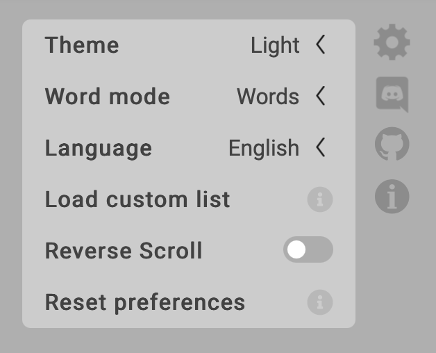

# TypeFast

TypeFast is a minimalistic typing speed tester that keeps versatility in mind. You can visit a live version of the master branch at [TypeFast.io](https://typefast.io).

## Screenshots

|                                   Light theme                                    |                                  Dark theme                                   |
| :------------------------------------------------------------------------------: | :---------------------------------------------------------------------------: |
|  |  |

|                                               Preferences                                                |
| :------------------------------------------------------------------------------------------------------: |
|  |

## Getting Started

TypeFast is built using Angular.

Run `npm install` to install all project dependencies.
You can then use `npm start` to start the development server at `http://localhost:4200/`.

## Contributing

If you would like to contribute to the project, feel free to fork this project and open a pull request.
Pleas make sure that:

- Your code is properly formatted, this project works with Prettier
- Your pull requests targets our develop branch

## Authors

- **Casper Verswijvelt** - _Everything_ -
  [CasperVerswijvelt](https://github.com/CasperVerswijvelt)

See also the list of
[contributors](https://github.com/CasperVerswijvelt/TypeFast/contributors)
who participated in this project.

## License

This project is licensed under the [MIT License](LICENSE)
Creative Commons License - see the [LICENSE](LICENSE) file for
details
